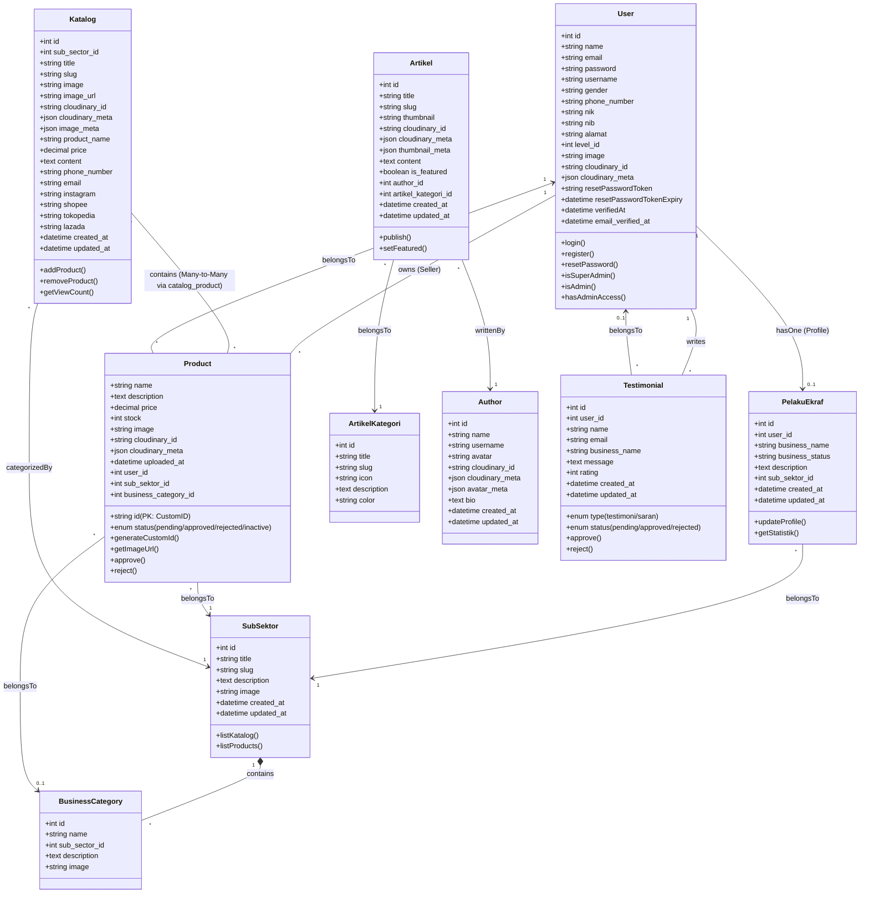

# Class Diagram Revisi - Ekraf Web

Dokumen ini berisi **Class Diagram** yang telah disesuaikan dengan implementasi kode aktual (`Project ekraf-web`) namun tetap mempertahankan struktur logis yang mudah dipahami. Diagram ini dirancang untuk **memperkuat argumen** dalam laporan kerja praktik/skripsi Anda.

## Hasil Analisis & Perbaikan dari Diagram Awal
Berdasarkan diagram yang Anda upload dan struktur kode yang ada, berikut adalah penyempurnaan yang dilakukan:

1.  **Penggabungan Aktor (Single Table Inheritance)**:
    *   **Diagram Lama**: Memisahkan `Admin` dan `Pengguna` sebaga class berbeda.
    *   **Kode Aktual**: Menggunakan satu class `User` dengan atribut `level_id`.
    *   **Argumen Kuat**: Efisiensi database dan sentralisasi otentikasi. Tidak perlu tabel terpisah untuk login; peran (Role) hanya dibedakan oleh flag/level.

2.  **Pemisahan Entitas Bisnis (Normalization)**:
    *   **Diagram Lama**: Atribut usaha mungkin tercampur di Pengguna.
    *   **Kode Aktual**: Memisahkan `User` (Data Login) dan `PelakuEkraf` (Data Bisnis).
    *   **Argumen Kuat**: *Separation of Concerns*. Akun pengguna tetap aman dan ringan, sementara profil bisnis yang kompleks disimpan terpisah. Profil bisnis bisa dihapus tanpa menghapus akun user.

3.  **Relasi Katalog & Produk (Many-to-Many)**:
    *   **Diagram Lama**: Katalog mungkin hanya menampung produk (1-to-many).
    *   **Kode Aktual**: Menggunakan tabel pivot `catalog_product`.
    *   **Argumen Kuat**: Fleksibilitas Pemasaran. Satu produk (misal: "Batik Tulis") bisa masuk ke "Katalog Batik" DAN "Katalog Promo Lebaran" secara bersamaan tanpa duplikasi data produk.

## Diagram Class (Mermaid)

## Penjelasan Argumen Desain (Untuk Bab Pembahasan)

### 1. Pola Active Record pada Entities
Diagram di atas menggunakan pola **Active Record** yang umum pada framework modern seperti Laravel (Eloquent ORM). Setiap kelas (User, Product, Katalog) merepresentasikan tabel dalam database sekaligus memiliki metode (behavior) untuk memanipulasi datanya sendiri (seperti `approve()`, `checkStock()`).
*   **Argumen**: Pendekatan ini mempercepat pengembangan dan memastikan bahwa logika bisnis data (seperti validasi stok) melekat erat pada datanya, mengurangi redundansi kode.

### 2. Normalisasi & Hierarki Kategori (Sub Sektor vs Business Category)
Dalam sistem ini, kategori tidak datar melainkan hierarkis. `SubSektor` (17 subsektor resmi) menjadi payung utama, di dalamnya terdapat `BusinessCategory` (misal: Kuliner -> Kopi, Kuliner -> Keripik).
*   **Argumen**: Desain ini mendukung skalabilitas data. Sistem bisa menangani ribuan jenis produk dengan tetap menjaga kerapian pengelompokan berdasarkan standar Ekonomi Kreatif nasional.

### 3. Fleksibilitas Katalog (Many-to-Many Relationship)
Hubungan antara `Katalog` dan `Product` adalah *Many-to-Many* (banyak-ke-banyak), bukan *One-to-Many*.
*   **Argumen**: Ini adalah fitur strategis untuk **Marketing**. Pelaku ekraf tidak perlu menginput ulang produk untuk membuat katalog berbeda (misalnya Katalog Natal vs Katalog Reguler). Satu objek produk yang sama bisa direferensikan di berbagai katalog, memastikan konsistensi harga dan stok di semua tempat.

### 4. Sistem Keamanan Berbasis Level (RBAC Sederhana)
Alih-alih membuat kelas `Admin` terpisah, sistem menggunakan atribut `level_id` pada kelas `User`.
*   **Argumen**: Menyederhanakan manajemen user. Jika suatu hari Pelaku Ekraf perlu diangkat menjadi Admin untuk sub-sektor tertentu, sistem hanya perlu mengubah nilai `level_id` tanpa perlu migrasi data antar tabel. Ini mempermudah maintenance jangka panjang.

### 5. Custom Primary Key pada Produk
Kelas `Product` memiliki metode `generateCustomId()`.
*   **Argumen**: Penggunaan ID yang "User Friendly" (misal: KUL001 untuk Kuliner) meningkatkan *usability* sistem dalam proses verifikasi manual dan komunikasi antara Admin dan Pelaku Ekraf, dibandingkan menggunakan Auto Increment ID (1, 2, 3) yang tidak bermakna.
