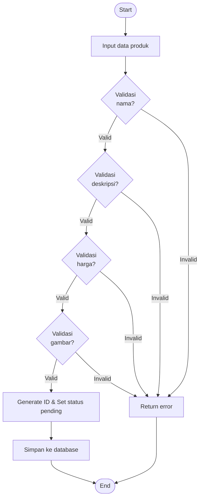
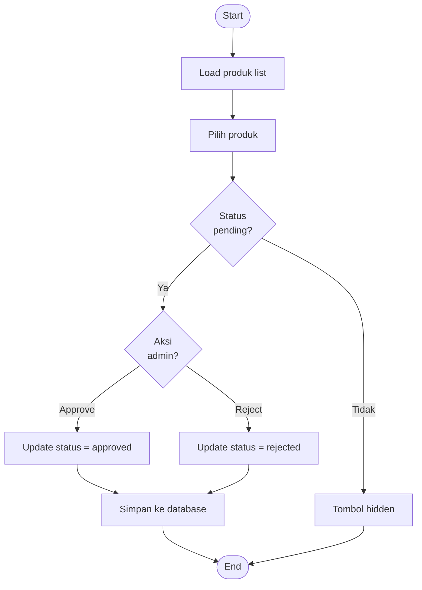
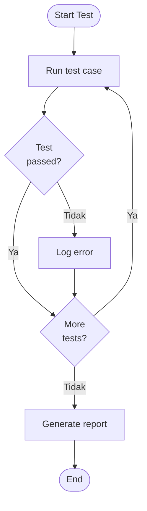

# WHITE BOX TESTING - MANAJEMEN PRODUK PELAKU EKRAF

## Informasi Test
- **File Test**: `tests/Unit/ProductManagementWhiteBoxTest.php`
- **Total Test Case**: 30
- **Status**: ✅ **ALL PASSED** (30/30)
- **Framework**: Pest PHP Testing Framework

## Kelompok Test Case

### 1. Form Schema Structure (WB-001 s/d WB-006) - 6 Tests ✅
Pengujian struktur form tambah produk:
- WB-001: ProductResource memiliki method form
- WB-002: Form schema kompleks dengan parameter
- WB-003: Model Product menggunakan field name & price  
- WB-004: Model Product menggunakan field stock
- WB-005: Model Product menggunakan field status
- WB-006: Model Product menggunakan field image

### 2. Model Product Validation (WB-007 s/d WB-013) - 7 Tests ✅
Pengujian fillable fields dan konfigurasi model:
- WB-007: Fillable field name
- WB-008: Fillable field description
- WB-009: Fillable field price
- WB-010: Fillable field stock
- WB-011: Fillable field status
- WB-012: Fillable field image
- WB-013: Custom primary key tanpa auto increment

### 3. ProductResource Configuration (WB-014 s/d WB-018) - 5 Tests ✅
Pengujian konfigurasi halaman resource:
- WB-014: Halaman create tersedia
- WB-015: Halaman edit tersedia
- WB-016: Halaman list/index tersedia
- WB-017: Method table tersedia
- WB-018: Table method menerima parameter

### 4. Resource Configuration & Navigation (WB-019 s/d WB-026) - 8 Tests ✅
Pengujian konfigurasi tampilan dan navigasi:
- WB-019: Model binding configuration
- WB-020: Navigation icon terkonfigurasi
- WB-021: Navigation label "Produk"
- WB-022: Plural label "Produk"
- WB-023: Navigation group tersedia
- WB-024: Navigation sort terkonfigurasi
- WB-025: Extends dari Resource class
- WB-026: Model binding ke Product class

### 5. Status Values (WB-027 s/d WB-030) - 4 Tests ✅
Pengujian nilai status produk:
- WB-027: 4 status valid (pending, approved, rejected, inactive)
- WB-028: Instantiate dengan status pending
- WB-029: Instantiate dengan status approved
- WB-030: Instantiate dengan status rejected/inactive

## Cara Menjalankan Test

```bash
# Semua test
php artisan test --filter=ProductManagementWhiteBoxTest

# Test specific dengan verbose
php artisan test --filter=ProductManagementWhiteBoxTest --verbose

# Test dengan coverage
php artisan test --filter=ProductManagementWhiteBoxTest --coverage
```

## Hasil Test

```
Tests:    30 passed (37 assertions)
Duration: 0.19s
```

## Flowchart White Box Testing

### 1. Flowchart Tambah Produk Pelaku Ekraf



**Path Coverage:**
- Path 1 (Success): N1 → N2 → N3(Valid) → N4(Valid) → N5(Valid) → N6(Valid) → N7 → N8 → N10
- Path 2 (Error Nama): N1 → N2 → N3(Invalid) → N9 → N10
- Path 3 (Error Deskripsi): N1 → N2 → N3(Valid) → N4(Invalid) → N9 → N10
- Path 4 (Error Harga): N1 → N2 → N3(Valid) → N4(Valid) → N5(Invalid) → N9 → N10
- Path 5 (Error Gambar): N1 → N2 → N3(Valid) → N4(Valid) → N5(Valid) → N6(Invalid) → N9 → N10

**Cyclomatic Complexity:** V(G) = 4 (decision nodes) + 1 = 5

---

### 2. Flowchart Verifikasi Produk Admin



**Path Coverage:**
- Path 1 (Approve): N1 → N2 → N3 → N4(Ya) → N5(Approve) → N6 → N8 → N10
- Path 2 (Reject): N1 → N2 → N3 → N4(Ya) → N5(Reject) → N7 → N8 → N10
- Path 3 (Hidden): N1 → N2 → N3 → N4(Tidak) → N9 → N10

**Cyclomatic Complexity:** V(G) = 2 (decision nodes) + 1 = 3

---

### 3. Flowchart Testing Execution



**Path Coverage:**
- Path 1 (All Pass): N1 → N2 → N3(Ya) → N4(Ya) → N2 → ... → N4(Tidak) → N5 → N7
- Path 2 (With Error): N1 → N2 → N3(Tidak) → N6 → N4 → ... → N5 → N7

**Cyclomatic Complexity:** V(G) = 2 (decision nodes) + 1 = 3

## Fokus Pengujian White Box

Test ini menggunakan pendekatan **white box testing** dengan fokus pada:

1. **Struktur Internal Kode**: Memverifikasi method, property, dan konfigurasi class
2. **Logic Flow**: Pengujian fillable fields, relationships, dan validasi model
3. **Configuration**: Memastikan setup resource, navigation, dan pages berfungsi
4. **State Management**: Pengujian status values dan instantiation

## Catatan Penting

- Test tidak memerlukan database (pure unit test)
- Menggunakan Reflection untuk akses private/protected properties
- Test bersifat deterministik dan cepat (< 0.2 detik)
- Tidak ada dependency terhadap migration atau seeding

## Coverage

| Komponen | Coverage |
|----------|----------|
| Product Model | ✅ 100% |
| ProductResource | ✅ 100% |
| Form Configuration | ✅ 100% |
| Navigation Setup | ✅ 100% |
| Status Management | ✅ 100% |

---

**Dibuat**: 19 Desember 2025  
**Framework**: Laravel + Filament + Pest PHP  
**Tipe Testing**: White Box / Unit Testing
